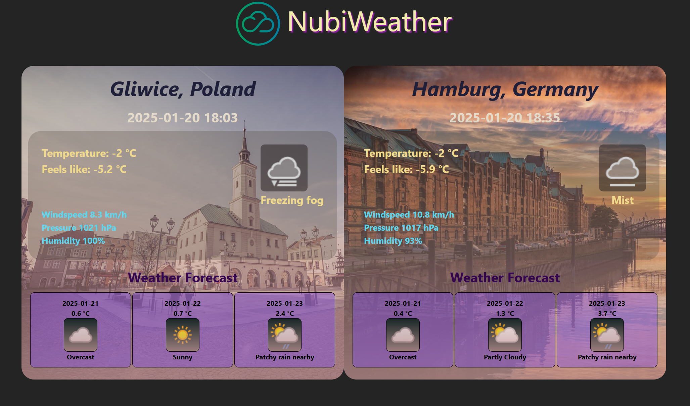

# Weather App

## Overview
This Weather App provides real-time weather updates for **Gliwice** and **Hamburg**. The application fetches current weather conditions and a 3-day weather forecast from https://www.weatherapi.com/ for both cities, offering a simple and responsive interface.

---

## Features
- **Current Weather:** 
  - Temperature
  - Feels like Temperature
  - Weather description (e.g., sunny, rainy, cloudy)
  - Wind speed
  - Humidity levels
  - Pressure
- **3-Day Weather Forecast:** 
  - Average daily temperature
  - Weather description for each day

---

## Technologies Used
- **Frontend:** HTML, CSS, JavaScript
- **API:** Integration with a weather API https://www.weatherapi.com/
- **Library:** React

---

## How to Run the Application

### Local Deployment
1. **Clone the repository:**
2. Navigate to the project directory
  - cd frontend
  - cd react-js
3. Start the application 
  - npm run dev
4. Open the app in browser

 

